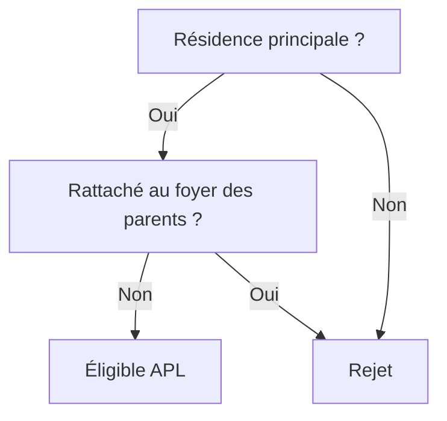

# Modéliser une aide

Modéliser une aide consiste à opérer la transmutation d'un texte réglementaire en une structure logique exécutable. Cette étape est critique : elle est à la fois un acte juridique (interprétation), conceptuel (abstraction) et technique (structuration). Une erreur à ce stade se répercutera sur tout le simulateur.

## 1. Qualifier la source et le périmètre

Avant de formaliser, il faut circonscrire la matière première. La hiérarchie des normes impose de distinguer les **sources primaires** (lois, décrets, arrêtés), qui font foi, des **sources secondaires** (circulaires, instructions techniques, documentation opérateur), qui éclairent l'application pratique mais peuvent contenir des simplifications.

L'analyse du texte doit permettre d'extraire quatre dimensions structurantes :
1.  **Les conditions d'éligibilité** (le "qui") : critères d'âge, de résidence, de statut.
2.  **Les modalités de calcul** (le "combien") : formules, barèmes, plafonds.
3.  **Les exceptions** (le "sauf si") : cas particuliers souvent nichés dans les alinéas.
4.  **La temporalité** (le "quand") : dates d'effet, périodes de référence des revenus.

## 2. Décomposer en variables

L'étape suivante est l'identification des atomes de logique : les variables. Il convient de les classer rigoureusement :
*   **Variables d'entrée** : données fournies par l'usager ou une API (ex: `date_naissance`).
*   **Variables de référence** : constantes réglementaires (ex: `plafond_ressources_2024`).
*   **Variables intermédiaires** : concepts calculés nécessaires à la logique (ex: `age` déduit de `date_naissance`).
*   **Variables de sortie** : le résultat final (ex: `montant_aide`).

Chaque variable doit être nommée de manière explicite (en français, pour coller au domaine métier) et documentée avec son type et sa source.

## 3. Formaliser la logique

Une fois les briques identifiées, il faut les assembler. Les conditions d'éligibilité se traduisent souvent par des arbres de décision booléens.

*Exemple de traduction logique (APL étudiant) :*
> "Le demandeur doit occuper le logement à titre de résidence principale et ne pas être rattaché au foyer fiscal de ses parents."

Devient :
`eligible = residence_principale ET (NON rattachement_foyer_parents)`

À ce stade, l'usage de diagrammes (nous conseillons Mermaid) est recommandé pour valider la logique avec les experts métier sans s'enfermer dans la syntaxe du code.

## 4. Du modèle au parcours utilisateur

La modélisation logique contraint l'interface. Pour concevoir le parcours, il faut ordonner les questions selon une stratégie d'entonnoir :
1.  **Élimination rapide** : poser d'abord les questions "couperet" (âge, résidence) pour éviter une saisie inutile aux usagers inéligibles.
2.  **Conditionnement** : n'afficher les questions détaillées que si elles sont pertinentes (ne demander la surface que si le logement est autonome).
3.  **Traduction en langage clair** : transformer le concept juridique ("Personne isolée au sens de l'article L.262-2") en question d'usage ("Vivez-vous seul ?"), en acceptant parfois une légère perte de précision au profit de la compréhension.
