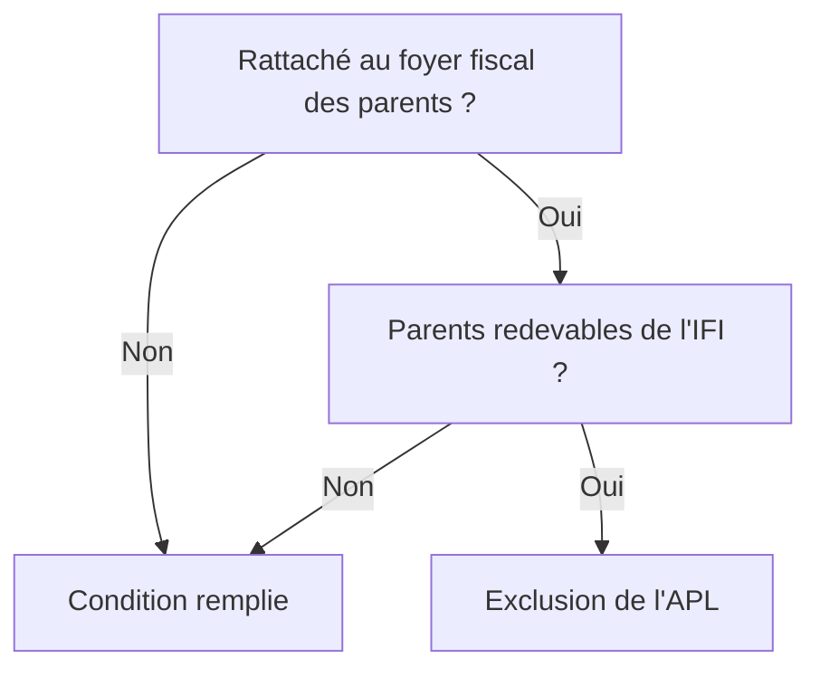

# Modéliser une aide

Modéliser une aide consiste à transformer un texte réglementaire en une structure logique exécutable. C'est à la fois une interprétation juridique, une abstraction et un travail de structuration. Une erreur à cette étape se retrouve dans tout le simulateur.

## Qualifier la source et le périmètre

La hiérarchie des normes distingue les sources primaires (lois, décrets, arrêtés), qui font foi, des sources secondaires (circulaires, instructions techniques, documentation des organismes), qui décrivent l'application pratique et peuvent simplifier la règle.

L'analyse du texte extrait quatre éléments :

- les conditions d'éligibilité : âge, résidence, statut ;
- les modalités de calcul : formules, barèmes, plafonds ;
- les exceptions, souvent placées dans les alinéas ;
- la temporalité : dates d'effet, périodes de référence des revenus.

## Décomposer en variables

Les variables se classent en quatre types :

- une variable d'entrée est une donnée fournie par l'usager ou par une API, par exemple `date_naissance` ;
- une variable de référence est une valeur réglementaire, par exemple `plafond_ressources_2024` ;
- une variable intermédiaire est calculée à partir d'autres variables, par exemple `age` déduit de `date_naissance` ;
- une variable de sortie est le résultat, par exemple `montant_aide`.

Chaque variable a un nom explicite, en français pour suivre le vocabulaire du domaine, et sa documentation donne son type et sa source.

## Formaliser la logique

Les variables s'assemblent ensuite en conditions. Les conditions d'éligibilité se traduisent en arbres de décision booléens.

*Exemple (APL étudiant), d'après [service-public.fr](https://www.service-public.fr/particuliers/vosdroits/F12006) :*
> « Vous ne pouvez pas bénéficier de l'APL si vous êtes rattaché au foyer fiscal de vos parents et que ces derniers payent l'impôt sur la fortune immobilière (IFI). »

Cette phrase devient la condition `exclusion_ifi = rattachement_foyer_parents ET parents_redevables_ifi`.

Un diagramme, en Mermaid par exemple, permet de valider cette logique avec les experts métier avant d'écrire le code.

```mermaid
flowchart TD
    A["Rattaché au foyer fiscal des parents ?"] -->|Non| OK["Condition remplie"]
    A -->|Oui| B["Parents redevables de l'IFI ?"]
    B -->|Non| OK
    B -->|Oui| X["Exclusion de l'APL"]
```

## Ordre des questions

La logique du modèle détermine l'ordre des questions du parcours :

- Les questions qui excluent le plus d'usagers (âge, résidence) viennent en premier, pour éviter une saisie inutile aux personnes non éligibles.
- Les questions détaillées s'affichent seulement si elles sont pertinentes : la surface du logement, par exemple, n'est demandée que pour un logement autonome.
- Chaque notion juridique se reformule en question courante : « Personne isolée au sens de l'article L. 262-2 » devient « Vivez-vous seul ? ». La reformulation perd parfois un peu de précision, et gagne en compréhension.
