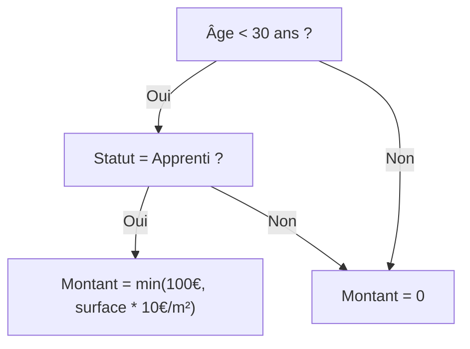

# Passer le modèle de règle en code

L'implémentation technique est l'étape où le modèle conceptuel devient un artefact exécutable. L'objectif : produire un code lisible, auditable et étroitement lié à sa source juridique.

## Glossaire des concepts clés

**Modéliser un dispositif** : Traduire un texte réglementaire écrit en langage naturel/juridique en langage formel (logique mathématique, organigramme, algorithme...)

**Un dispositif** : Une ou plusieurs règles qui ensemble visent à régir une situation particulière ou produire un effet juridique précis. *Exemple : aide personnalisée au logement*

**Une règle** : Une portion d'un texte réglementaire (une ou plusieurs *mesures*) que l'on peut identifier comme étant une instruction émise par les législateurs. *Exemple : règle d'éligibilité d'une personne à l'APL en cas de location en foyer*

> Pour les définitions complètes, voir le [glossaire](/99_ressources/glossaire) (dispatcher, entité, foyer fiscal, etc.).

## Deux formalismes complémentaires

Il est crucial de distinguer deux couches de modélisation qui doivent cohabiter sans se mélanger :
1.  **La modélisation algorithmique** : Elle traduit la règle telle qu'elle est écrite dans la loi (conditions, seuils, barèmes). Elle doit être exhaustive et fidèle.
2.  **La modélisation du parcours** : Elle adapte la règle à l'expérience utilisateur (simplification du langage, ordre des questions).

## Choisir le moteur de règles

Le choix du moteur détermine la philosophie de l'implémentation.

**Publicodes** (YAML) privilégie la **transparence**.
*   *Forces* : Lisible par les non-dév, exécution client (web), documentation interactive générée automatiquement.
*   *Cible* : Simulateurs pédagogiques, parcours exploratoires (*mon-entreprise*).

**OpenFisca** (Python) privilégie la **puissance de modélisation**.
*   *Forces* : Gestion native des entités complexes (foyers) et du temps (périodes glissantes), calcul massif sur serveur.
*   *Cible* : Systèmes socio-fiscaux complets, calculs de droits proches des applications réelles (impôts, prestations sociales).

## Exemple comparatif : Mobili-jeunes

Prenons une règle simplifiée : *"Aide de 100€ max pour les apprentis de moins de 30 ans, plafonnée à 10€/m² de loyer"*.

### Modèle conceptuel



### Implémentation OpenFisca (Python)

La logique est encapsulée dans des classes typées, avec une gestion explicite des entités et périodes.

```python
class mobili_jeunes_eligibilite(Variable):
    value_type = bool
    entity = Individu
    label = "Eligibilité Mobili Jeunes"
    definition_period = MONTH
    
    def formula(individu, period):
        age = individu('age', period)
        apprenti = individu('apprenti', period)
        return (age < 30) * apprenti
```

### Implémentation Publicodes (YAML)

La logique est décrite comme une phrase structurée, lisible presque comme du français.

```yaml
mobili-jeunes . éligibilité:
  formule:
    toutes ces conditions:
      - âge < 30
      - apprenti = oui

mobili-jeunes . montant:
  formule:
    le minimum de:
      - 100 €/mois
      - surface logement * 10 €/m²
    applicable si: mobili-jeunes . éligibilité
```

## Connecter le modèle au formulaire

Une fois le modèle codé, il faut le brancher à l'interface. C'est là que se jouent les choix d'architecture (voir [Patterns architecturaux](/03_mutualiser/03_patterns)) :
*   **Mapping direct** : Le champ du formulaire porte le même nom que la variable (simple mais rigide).
*   **Mapping avec transformation** : Une couche de code (dispatchers) traduit la réponse usager en variables moteur (flexible mais complexe à auditer).
