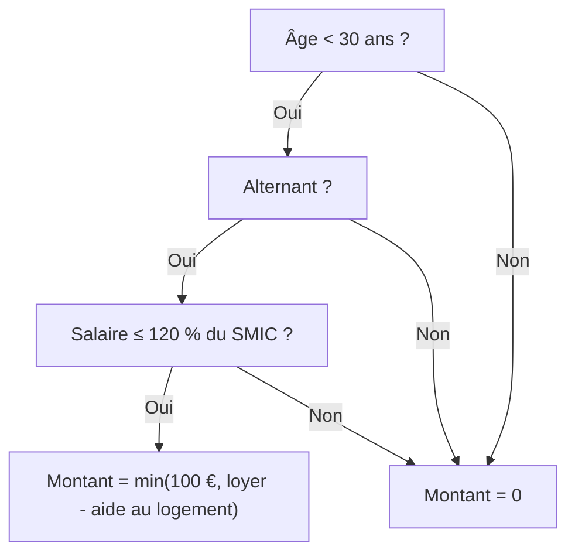

# Écrire le modèle de règles

Cette étape écrit le modèle de règles dans un moteur. Le code obtenu se lit, se vérifie et cite ses sources juridiques.

Les définitions de dispositif, de règle et de modélisation figurent au [glossaire](/99_ressources/glossaire).

## Modèle de la règle et modèle du parcours

Deux modèles se tiennent dans des fichiers séparés :

- le modèle de la règle suit le texte (conditions, seuils, barèmes), de façon complète et fidèle ;
- le modèle du parcours adapte la règle à l'usager (questions reformulées, ordre des questions).

## Choisir un moteur ouvert

Le moteur détermine la façon d'écrire les règles et le lieu du calcul.

Publicodes décrit les règles en YAML, avec des noms de règles en français. Son moteur JavaScript calcule dans le navigateur ou sur un serveur, et génère une documentation interactive de chaque calcul. Il convient aux simulateurs pédagogiques et aux parcours où l'usager fait varier ses réponses, comme mon-entreprise.

OpenFisca décrit les règles en Python. Il gère plusieurs entités liées (individu, famille, foyer fiscal, ménage) et des périodes de calcul, et s'exécute sur un serveur, en général derrière une API. Il convient aux calculs socio-fiscaux où les aides dépendent les unes des autres (impôts, prestations sociales).

## Exemple : l'aide Mobili-Jeune

Version simplifiée de l'[aide Mobili-Jeune](https://www.actionlogement.fr/aide-mobili-jeune) d'Action Logement : *aide de 10 € à 100 € par mois pour les alternants de moins de 30 ans dont le salaire ne dépasse pas 120 % du SMIC, calculée sur le loyer restant après l'aide au logement*.

### Diagramme de la règle


```mermaid
graph TD
    A["Âge < 30 ans ?"] -->|"Oui"| B["Alternant ?"]
    B -->|"Oui"| S["Salaire ≤ 120 % du SMIC ?"]
    S -->|"Oui"| C["Montant = min(100 €, loyer - aide au logement)"]
    S -->|"Non"| D["Montant = 0"]
    B -->|"Non"| D
    A -->|"Non"| D
```

### OpenFisca

Chaque variable est une classe Python, avec son entité et sa période.

```python
class mobili_jeune_eligibilite(Variable):
    value_type = bool
    entity = Individu
    label = "Éligibilité à l'aide Mobili-Jeune"
    definition_period = MONTH

    def formula(individu, period, parameters):
        age = individu('age', period)
        alternant = individu('alternant', period)
        salaire = individu('salaire_de_base', period)
        smic = parameters(period).marche_travail.salaire_minimum.smic.smic_b_mensuel
        return (age < 30) * alternant * (salaire <= 1.2 * smic)


class mobili_jeune(Variable):
    value_type = float
    entity = Individu
    label = "Montant de l'aide Mobili-Jeune"
    definition_period = MONTH

    def formula(individu, period):
        eligible = individu('mobili_jeune_eligibilite', period)
        reste = individu.menage('loyer', period) - individu.famille('aide_logement', period)
        return eligible * min_(100, max_(reste, 0))
```

### Publicodes

Chaque règle a un nom en français et se compose de mécanismes (`toutes ces conditions`, `le minimum de`).

```yaml
mobili-jeune . éligibilité:
  toutes ces conditions:
    - âge < 30
    - alternant = oui
    - salaire brut <= 120% * SMIC

mobili-jeune . montant:
  applicable si: éligibilité
  valeur:
    le minimum de:
      - 100 €/mois
      - loyer - aide au logement
```

## Relier le modèle au formulaire

Le modèle se relie ensuite à l'interface, selon l'un des choix décrits dans [Patterns architecturaux](/03_mutualiser/03_patterns) :

- Le champ du formulaire a le même nom que la variable du moteur : le code est simple, et le formulaire suit la structure du modèle.
- Une fonction de conversion transforme chaque réponse en une ou plusieurs variables du moteur : le formulaire est libre, et cette fonction doit être documentée pour être auditée.
