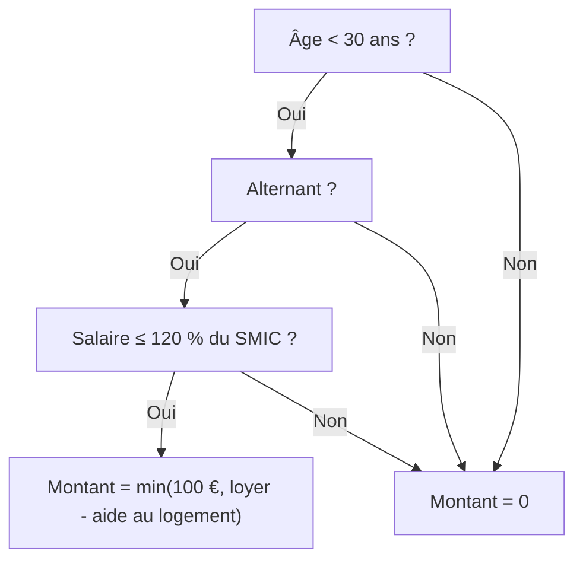

# Passer le modèle de règle en code

L'implémentation technique est l'étape où le modèle conceptuel devient un artefact exécutable. L'objectif : produire un code lisible, auditable et étroitement lié à sa source juridique.

## Glossaire des concepts clés

**Modéliser un dispositif** : Traduire un texte réglementaire écrit en langage naturel/juridique en langage formel (logique mathématique, organigramme, algorithme...)

**Un dispositif** : Une ou plusieurs règles qui ensemble visent à régir une situation particulière ou produire un effet juridique précis. *Exemple : aide personnalisée au logement*

**Une règle** : Une portion d'un texte réglementaire (une ou plusieurs *mesures*) que l'on peut identifier comme étant une instruction émise par les législateurs. *Exemple : règle d'éligibilité d'une personne à l'APL en cas de location en foyer*

> Pour les définitions complètes, voir le [glossaire](/99_ressources/glossaire) (dispatcher, entité, foyer fiscal, etc.).

## Deux formalismes complémentaires

Il est crucial de distinguer deux couches de modélisation qui doivent cohabiter sans se mélanger :
1.  **La modélisation algorithmique** : Elle traduit la règle telle qu'elle est écrite dans la loi (conditions, seuils, barèmes). Elle doit être exhaustive et fidèle.
2.  **La modélisation du parcours** : Elle adapte la règle à l'expérience utilisateur (simplification du langage, ordre des questions).

## Choisir le moteur de règles

Le choix du moteur détermine la philosophie de l'implémentation.

**Publicodes** (YAML) privilégie la **transparence**.
*   *Forces* : Lisible par les non-dév, exécution client (web), documentation interactive générée automatiquement.
*   *Cible* : Simulateurs pédagogiques, parcours exploratoires (*mon-entreprise*).

**OpenFisca** (Python) privilégie la **puissance de modélisation**.
*   *Forces* : Gestion native des entités complexes (foyers) et du temps (périodes glissantes), calcul massif sur serveur.
*   *Cible* : Systèmes socio-fiscaux complets, calculs de droits proches des applications réelles (impôts, prestations sociales).

## Exemple comparatif : Mobili-jeunes

Prenons une version simplifiée de l'[aide Mobili-Jeune](https://www.actionlogement.fr/aide-mobili-jeune) d'Action Logement : *aide de 10 € à 100 € par mois pour les alternants de moins de 30 ans dont le salaire ne dépasse pas 120 % du SMIC, calculée sur le loyer restant après l'aide au logement*.

### Modèle conceptuel


```mermaid
graph TD
    A["Âge < 30 ans ?"] -->|"Oui"| B["Alternant ?"]
    B -->|"Oui"| S["Salaire ≤ 120 % du SMIC ?"]
    S -->|"Oui"| C["Montant = min(100 €, loyer - aide au logement)"]
    S -->|"Non"| D["Montant = 0"]
    B -->|"Non"| D
    A -->|"Non"| D
```

### Implémentation OpenFisca (Python)

La logique est encapsulée dans des classes typées, avec une gestion explicite des entités et périodes.

```python
class mobili_jeune_eligibilite(Variable):
    value_type = bool
    entity = Individu
    label = "Éligibilité à l'aide Mobili-Jeune"
    definition_period = MONTH

    def formula(individu, period, parameters):
        age = individu('age', period)
        alternant = individu('alternant', period)
        salaire = individu('salaire_de_base', period)
        smic = parameters(period).marche_travail.salaire_minimum.smic.smic_b_mensuel
        return (age < 30) * alternant * (salaire <= 1.2 * smic)


class mobili_jeune(Variable):
    value_type = float
    entity = Individu
    label = "Montant de l'aide Mobili-Jeune"
    definition_period = MONTH

    def formula(individu, period):
        eligible = individu('mobili_jeune_eligibilite', period)
        reste = individu.menage('loyer', period) - individu.famille('aide_logement', period)
        return eligible * min_(100, max_(reste, 0))
```

### Implémentation Publicodes (YAML)

La logique est décrite comme une phrase structurée, lisible presque comme du français.

```yaml
mobili-jeune . éligibilité:
  toutes ces conditions:
    - âge < 30
    - alternant = oui
    - salaire brut <= 120% * SMIC

mobili-jeune . montant:
  applicable si: éligibilité
  valeur:
    le minimum de:
      - 100 €/mois
      - loyer - aide au logement
```

## Connecter le modèle au formulaire

Une fois le modèle codé, il faut le brancher à l'interface. C'est là que se jouent les choix d'architecture (voir [Patterns architecturaux](/03_mutualiser/03_patterns)) :
*   **Mapping direct** : Le champ du formulaire porte le même nom que la variable (simple mais rigide).
*   **Mapping avec transformation** : Une couche de code (dispatchers) traduit la réponse usager en variables moteur (flexible mais complexe à auditer).
