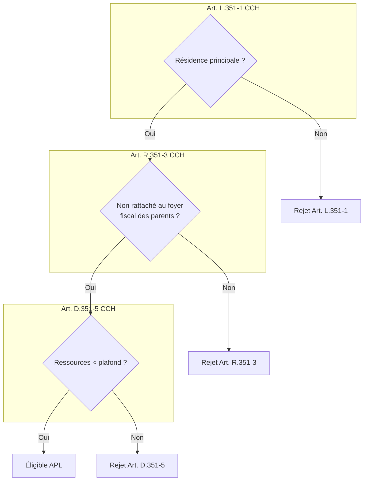
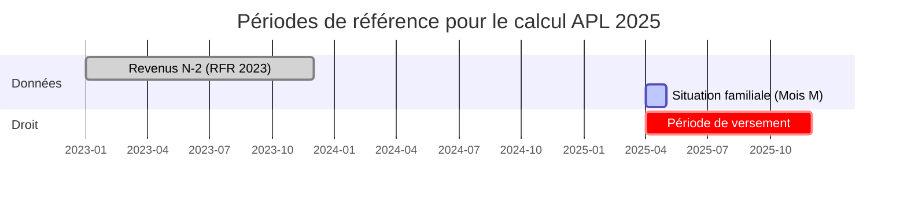
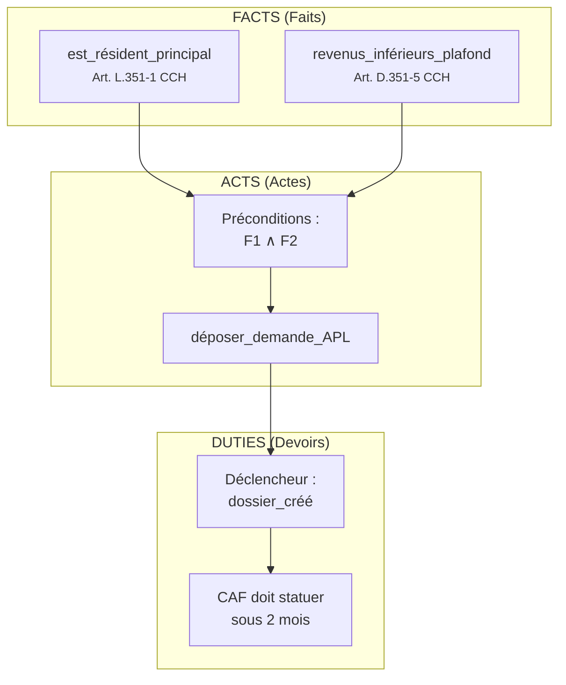
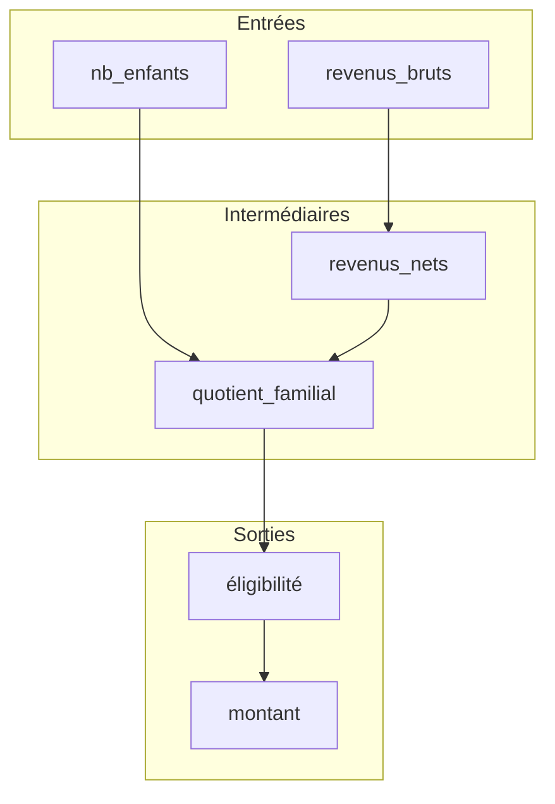
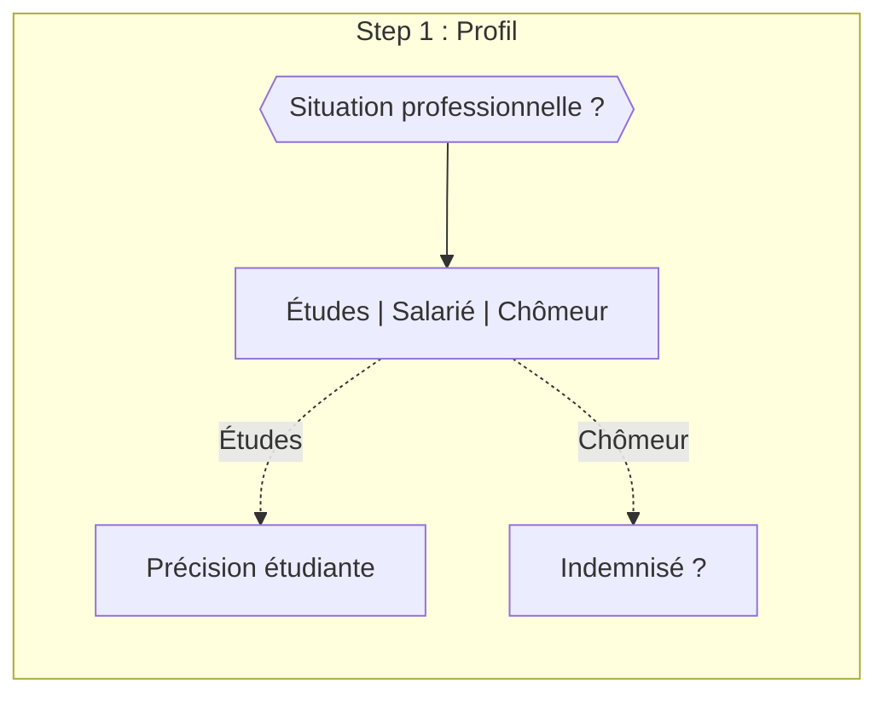
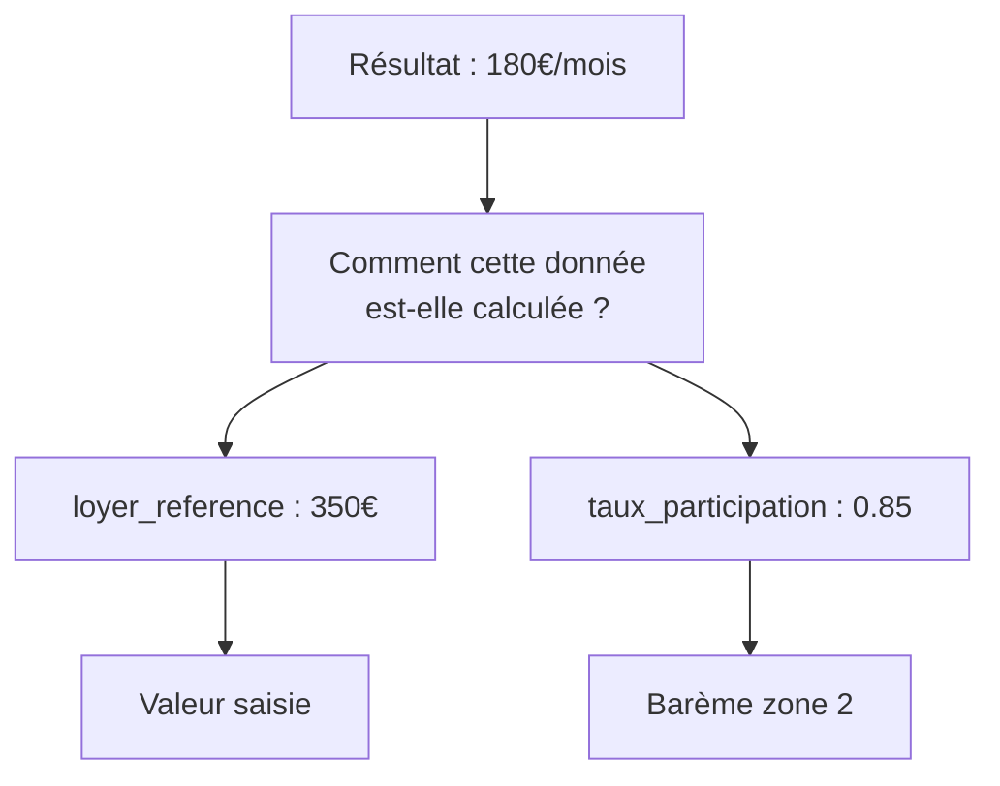
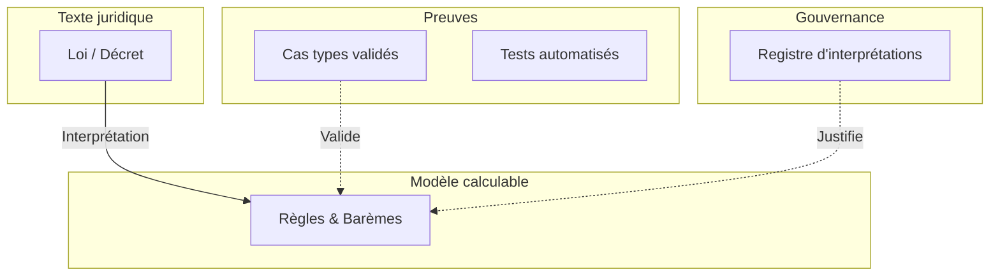
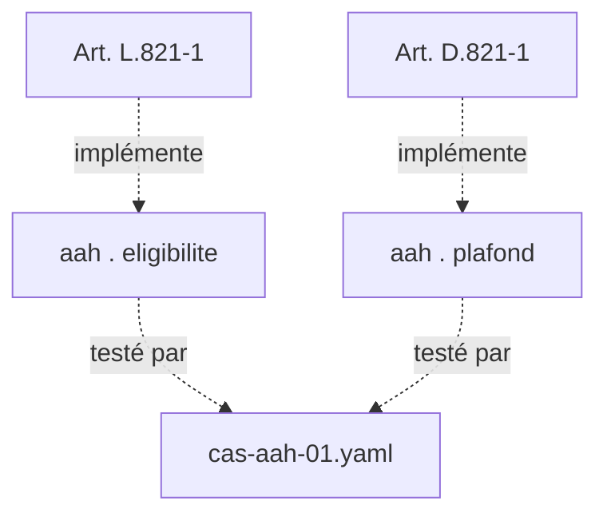

# Ressources visuelles

Le "Rules as Code" souffre d'un déficit de représentation : le code est illisible pour les juristes, et le texte de loi est ambigu pour les développeurs. Les diagrammes ne sont pas de simples illustrations, mais des objets frontières essentiels pour aligner ces deux mondes. Cette page présente les modèles de visualisation qui ont fait leurs preuves pour faciliter le dialogue interdisciplinaire, organisés par phase de projet.

## 1. Modéliser la logique (phase de conception)

Avant d'écrire une ligne de code, il est crucial de s'accorder sur l'interprétation du texte.

### L'arbre de décision annoté

Contrairement à un flowchart technique classique, cet arbre doit explicitement lier chaque embranchement à sa source juridique. C'est le support privilégié des ateliers juriste/développeur.

## Visualiser les temporalités

Les règles socio-fiscales impliquent souvent des décalages temporels complexes (revenus N-2, situation au 1er janvier). Le diagramme de Gantt permet de clarifier ces périodes de référence pour l'équipe technique et les usagers.

*Usage : Spécification des règles de gestion temporelle (OpenFisca) et pédagogie usager.*

### La décomposition FLINT (Actes / Faits / Devoirs)

Pour une modélisation rigoureuse, notamment dans les contextes de contestabilité forte, le langage [FLINT](https://gitlab.com/normativesystems) (TNO) propose de décomposer la norme en "frames" sémantiques.

### Le graphe de dépendances de variables

Ce schéma explicite comment les données d'entrée se transforment en résultat. Il est essentiel pour comprendre l'impact d'une modification réglementaire ("si le plafond change, quelles règles sont affectées ?").

## 2. Concevoir le parcours (phase UX)

### Le parcours déclaratif conditionnel

Dans une architecture où le formulaire est défini par un schéma autonome (approche *aides-simplifiées*), le diagramme de flux permet de visualiser la logique d'affichage conditionnel (`visibleWhen`).

*Ce diagramme peut être généré automatiquement à partir du fichier JSON de configuration du formulaire.*

## 3. Implémenter et Expliquer (Phase de dev)

### L'explicabilité du calcul

Un simulateur doit pouvoir justifier son résultat. Avec des outils comme `@publicodes/react-ui`, on peut visualiser la remontée du calcul.

## 4. Maintenir et Tracer (Phase de run)

### La chaîne de traçabilité (Le jumeau réglementaire)

Pour garantir l'auditabilité, il faut représenter la chaîne complète de la donnée, du texte de loi jusqu'à l'écran de l'usager.

### Traçabilité fine : du droit au test

Ce schéma établit la correspondance précise pour les revues de conformité.

## Inspiration : La "Living Documentation"

Une pratique classique est de maintenir ces diagrammes manuellement (Figma, PowerPoint). Cela présente des avantages en flexibilité, mais ils risquent de devenir obsolètes dès la première modification du code.

Une piste inspirante est de tendre vers la **"Living Documentation"** : des représentations toujours à jour ("Evergreen"), générées automatiquement à partir du code ou de la configuration.

**Principe directeur** : La règle calculable est le noyau. Tout le reste (interfaces, diagrammes, documentation) gagne à en être une projection.
