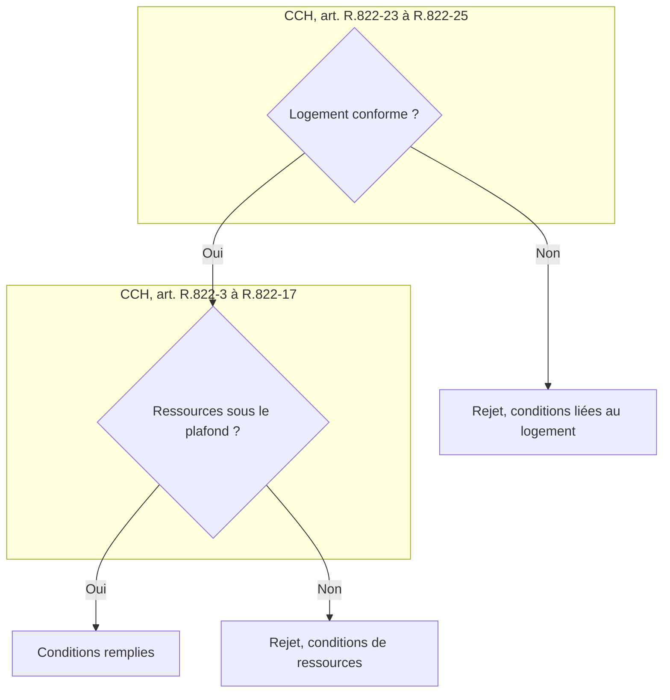
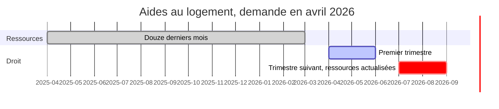
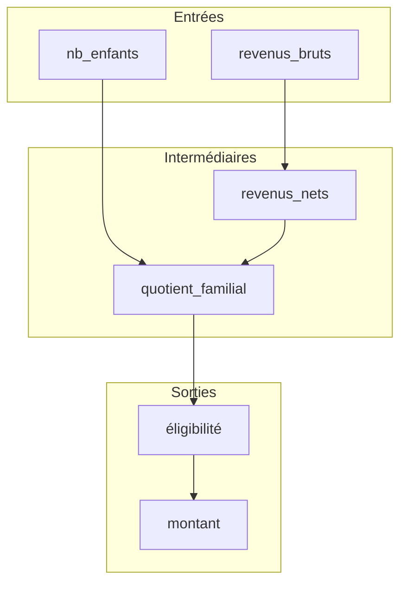
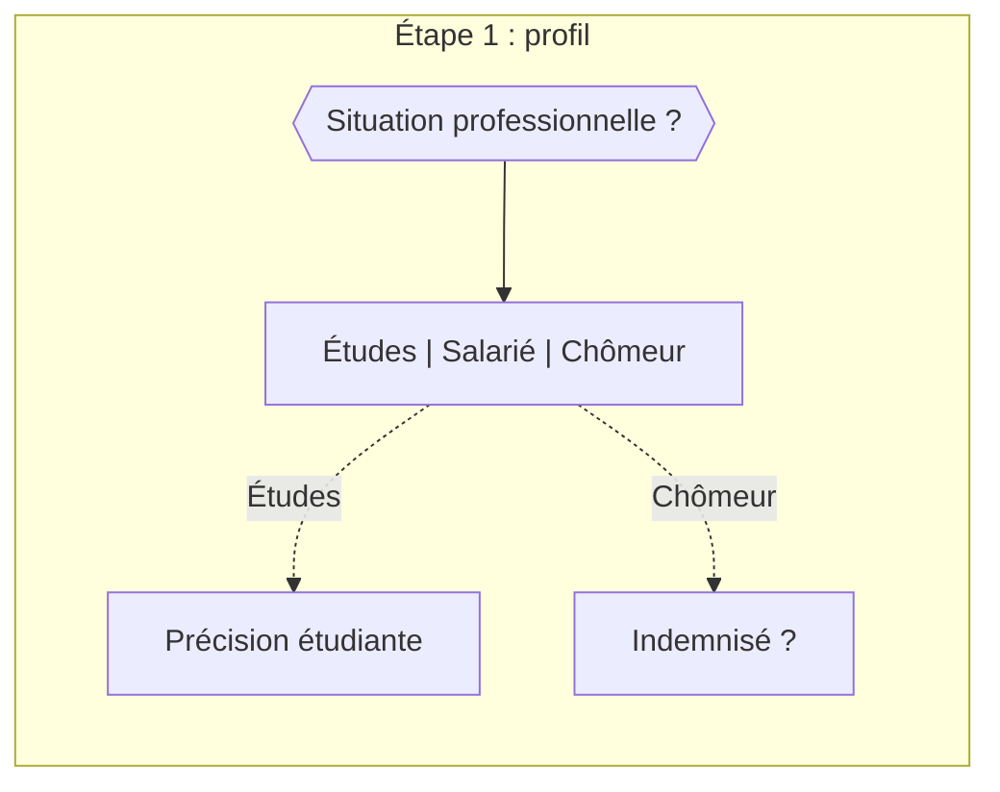
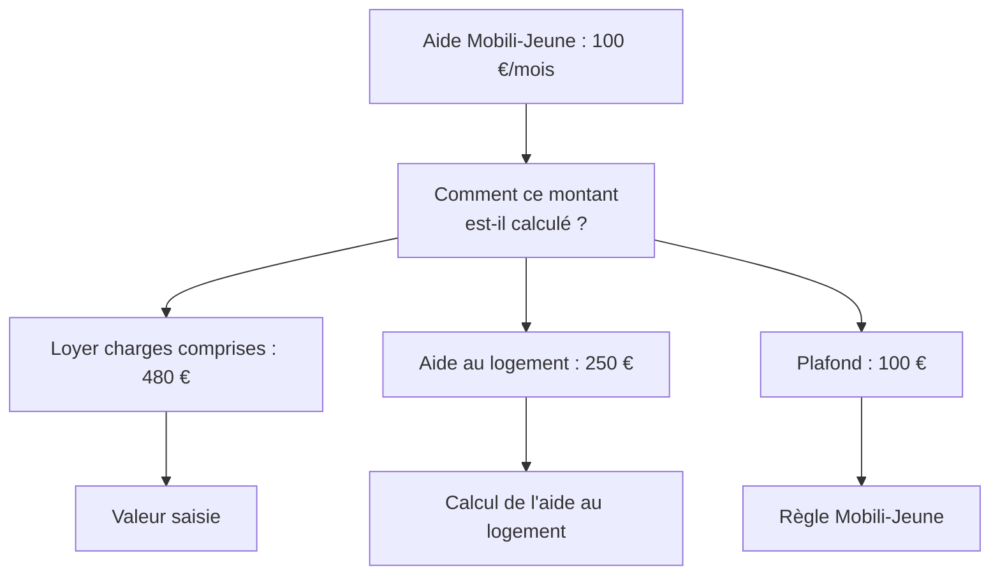

# Ressources visuelles

Le code d'un modèle de règles est difficile à lire pour un juriste, et un texte de loi laisse des ambiguïtés que le développeur doit trancher. Les diagrammes donnent aux deux un support commun. Cette page présente les diagrammes employés à chaque étape d'un projet.

## Diagrammes de modélisation

Juristes et développeurs s'accordent sur l'interprétation du texte avant d'écrire le code.

### L'arbre de décision annoté

Chaque embranchement de l'arbre cite les articles dont il découle. C'est le support des ateliers entre juristes et développeurs.

```mermaid
flowchart TD
    subgraph "CCH, art. R.822-23 à R.822-25"
        A1{Logement conforme ?}
    end
    
    subgraph "CCH, art. R.822-3 à R.822-17"
        A2{Ressources sous le plafond ?}
    end
    
    A1 -->|Oui| A2
    A1 -->|Non| X1[Rejet, conditions liées au logement]
    A2 -->|Oui| OK[Conditions remplies]
    A2 -->|Non| X2[Rejet, conditions de ressources]
```

### Périodes de référence

Les règles socio-fiscales emploient plusieurs périodes de référence : revenus de l'année N-2, ressources des douze derniers mois, situation au 1er janvier. Un diagramme de Gantt les montre à l'équipe technique et aux usagers. Par exemple, les aides au logement se calculent sur les ressources des douze derniers mois, actualisées tous les trois mois ([service-public.fr](https://www.service-public.fr/particuliers/vosdroits/F12006)).

```mermaid
gantt
    title Aides au logement, demande en avril 2026
    dateFormat YYYY-MM
    axisFormat %Y-%m
    
    section Ressources
    Douze derniers mois                :done, 2025-04, 2026-03
    
    section Droit
    Premier trimestre                  :active, 2026-04, 2026-06
    Trimestre suivant, ressources actualisées :crit, 2026-07, 2026-09
```

Usage : spécification des périodes dans le modèle (OpenFisca) et explication aux usagers.

### Le graphe de dépendances de variables

Ce graphe montre comment les données d'entrée produisent le résultat. Il répond à la question posée à chaque modification réglementaire : si le plafond change, quelles règles changent ?

```mermaid
flowchart TD
    subgraph Entrées
        E1[revenus_bruts]
        E2[nb_enfants]
    end
    
    subgraph Intermédiaires
        I1[revenus_nets]
        I2[quotient_familial]
    end
    
    subgraph Sorties
        S1[éligibilité]
        S2[montant]
    end
    
    E1 --> I1
    E2 --> I2
    I1 --> I2
    I2 --> S1
    S1 --> S2
```

## Diagrammes de parcours

### Le parcours conditionnel

Quand le questionnaire est décrit dans un fichier séparé des règles, un diagramme de flux montre les conditions d'affichage des questions (`visibleWhen`).

```mermaid
flowchart TD
    subgraph "Étape 1 : profil"
        direction TB
        Q1{{"Situation professionnelle ?"}}
        Q1_choices["Études | Salarié | Chômeur"]
        Q2["Précision étudiante"]
        Q3["Indemnisé ?"]
    end

    Q1 --> Q1_choices
    Q1_choices -.->|"Études"| Q2
    Q1_choices -.->|"Chômeur"| Q3
```

Ce diagramme peut se générer à partir du fichier JSON du questionnaire.

## Explication d'un résultat

Un simulateur montre comment il obtient son résultat. Avec `@publicodes/react-ui`, l'usager remonte le calcul variable par variable. Exemple avec l'aide Mobili-Jeune et les montants du cas type `dem-log-001` :

```mermaid
flowchart TD
    R["Aide Mobili-Jeune : 100 €/mois"]
    R --> D1["Comment ce montant<br/>est-il calculé ?"]
    
    D1 --> V1["Loyer charges comprises : 480 €"]
    D1 --> V2["Aide au logement : 250 €"]
    D1 --> V3["Plafond : 100 €"]
    
    V1 --> S1["Valeur saisie"]
    V2 --> S2["Calcul de l'aide au logement"]
    V3 --> S3["Règle Mobili-Jeune"]
```

## Générer les diagrammes depuis le code

Des diagrammes dessinés à la main (Figma, PowerPoint) se modifient librement, et doivent être repris à chaque modification du code. Générés à partir du code ou de la configuration, ils suivent le modèle à chaque version : c'est la pratique que Cyrille Martraire décrit dans *Living Documentation* (2019).
