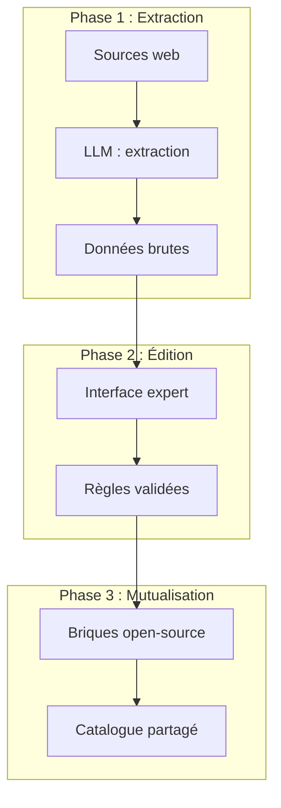

# Interfaces de contribution et IA

Si le mouvement "Rules as Code" promet de rendre le droit exécutable, il se heurte aujourd'hui à une barrière majeure : la technicité. La traduction de la loi en code reste l'apanage de développeurs spécialisés, créant un goulot d'étranglement et une dépendance risquée. Pour passer à l'échelle, l'enjeu est de **démocratiser l'écriture des règles**, en outillant les experts métier (juristes, gestionnaires) pour qu'ils deviennent contributeurs directs du code.

## Une typologie des interfaces de contribution

Il n'existe probablement pas d'interface parfaite en matière de saisie de règle, mais plutôt un continuum d'outils adaptés à différents niveaux d'abstraction et de compétence technique.

### 1. L'édition paramétrique (Le modèle CMS)
C'est le niveau le plus accessible, adapté à la maintenance courante. L'expert ne touche pas à la logique, mais met à jour des valeurs via des formulaires structurés.
*   **Usage** : Mise à jour annuelle des plafonds, des montants d'aides, des dates de validité.
*   **Outils** : CMS "Headless" (Decap CMS, Strapi) connectés à des fichiers de configuration (YAML/JSON).
*   **Avantage** : Sécurité totale (impossible de casser la logique).
*   **Limite** : Permet difficilement de modifier la structure même de la règle (ajout de conditions, de variables).

### 2. La logique tabulaire (Le modèle Excel)
Le tableur reste l'outil roi de l'administration. Les standards comme DMN (Decision Model and Notation) permettent de formaliser des règles complexes sous forme de tables de décision, un format familier pour les gestionnaires.
*   **Usage** : Barèmes progressifs, matrices de droits, conditions multicritères.
*   **Outils** : éditeurs de tables DMN.
*   **Avantage** : Lisibilité immédiate, format compact, standard industriel.
*   **Limite** : Devient difficile à maintenir pour des règles avec de nombreuses dépendances imbriquées.

### 3. La programmation visuelle (Le modèle No-Code)
Représenter la règle sous forme de graphe ou d'arbre de décision permet de visualiser le flux logique. C'est l'approche privilégiée par les outils de "Business Rules Management Systems" (BRMS) modernes.
*   **Usage** : Conception de parcours d'éligibilité, visualisation des embranchements.
*   **Outils** : [GoRules](https://gorules.io/), [n8n](https://n8n.io/).
*   **Recherche** : [Blawx](https://github.com/Lexpedite/blawx/) propose une approche de "programmation visuelle par blocs" (type Scratch) spécifiquement adaptée à la logique juridique.
*   **Avantage** : Intuitif pour comprendre la structure globale ("Big Picture").
*   **Limite** : Risque du "plat de spaghettis" visuel dès que la complexité augmente.

### 4. Le langage naturel contrôlé (Le modèle Gherkin)
L'idéal d'une écriture proche du langage naturel, qui serait à la fois lisible par l'humain et exécutable par la machine.
*   **Usage** : Spécification de règles métier, tests d'acceptation.
*   **Outils** : Publicodes (qui est proche d'un langage naturel structuré), [Oracle Intelligent Advisor](https://www.oracle.com/cx/service/intelligent-advisor/) (anciennement OPA, la référence propriétaire qui compile Word/Excel en règles).
*   **Avantage** : Réduit la fracture entre le texte de loi et le code.

### 5. La programmation littéraire (Le modèle Catala)
Une approche exigeante où le code et la loi sont entremêlés dans le même fichier source.
*   **Usage** : Législation critique nécessitant une preuve formelle de correction.
*   **Outils** : [Catala](https://catala-lang.org/) (INRIA).
*   **Avantage** : Permet de prouver mathématiquement que le code couvre tous les cas de la loi.
*   **Limite** : Nécessite une collaboration étroite (pair programming) entre un juriste et un développeur de haut niveau.

## L'IA générative comme assistante

Les modèles de langage (LLM) ouvrent des perspectives intéressantes pour abaisser la barrière d'entrée, à condition d'être utilisés avec discernement.

### L'IA comme "colle" sémantique
Plutôt que de demander à l'IA d'écrire le code final (risqué), elle pourrait agir comme une interface de médiation :
*   **Extraction** : Transformer des textes réglementaires non structurés (pages web, PDF) en données pré-structurées.
*   **Mapping** : Suggérer des correspondances entre les concepts d'un texte de loi et les variables existantes du catalogue.
*   **Explication** : Générer des résumés en langage clair à partir du code complexe, pour faciliter la validation par les juristes.

### L'exemple de la construction de référentiels
Le projet *Tous à bord* a démontré la pertinence de cette approche pour constituer un référentiel national des tarifs sociaux des transports. L'équipe a croisé des sources institutionnelles (SIREN, ressorts territoriaux) avec une extraction automatisée des critères d'éligibilité depuis les sites web des transporteurs.

Dans ce pipeline, le LLM n'invente pas la règle ; il extrait une information factuelle ("le tarif réduit est accessible aux demandeurs d'emploi") depuis une source non structurée. Le résultat est un jeu de données vérifiable, soumis ensuite à la validation des autorités organisatrices.

Ce pattern "extraction IA -> structuration -> validation humaine" pourrait être généralisé pour peupler les catalogues de règles à partir de l'existant.

## Principes directeurs pour un IDE juridique

Pour construire ces interfaces du futur, nous proposons trois principes de design :

### 1. Le code reste la source de vérité
L'interface (visuelle, tabulaire ou conversationnelle) n'est qu'une **vue** sur le code. Elle ne doit pas enfermer la règle dans un format propriétaire. Le fichier source (ex: Publicodes) doit rester lisible et éditable manuellement si besoin.

### 2. La validation par le test (Test-Driven Regulation)
La meilleure façon pour un expert métier de contribuer n'est parfois pas d'écrire la règle, mais d'écrire le **test**. C'est le principe du **Behavior-Driven Development (BDD)**.
*   *L'expert dit* : "Dans telle situation (revenu X, situation Y), l'usager doit toucher Z euros."
*   *Le développeur* : Écrit la règle qui satisfait ce test.
L'interface de contribution doit donc être avant tout une interface de définition de cas-types (fixtures), potentiellement utilisant la syntaxe **Gherkin** ("Given/When/Then") pour formaliser ces attentes.

### 3. La traçabilité radicale
Chaque règle modifiée via une interface simplifiée doit garder le lien avec sa source (l'article de loi, la délibération). L'interface doit forcer la citation de la source avant d'accepter une modification.
